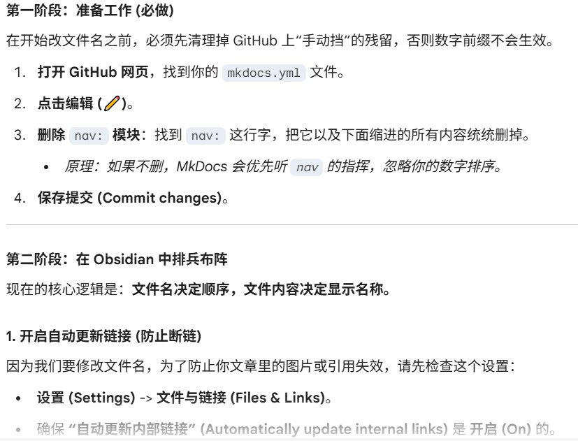
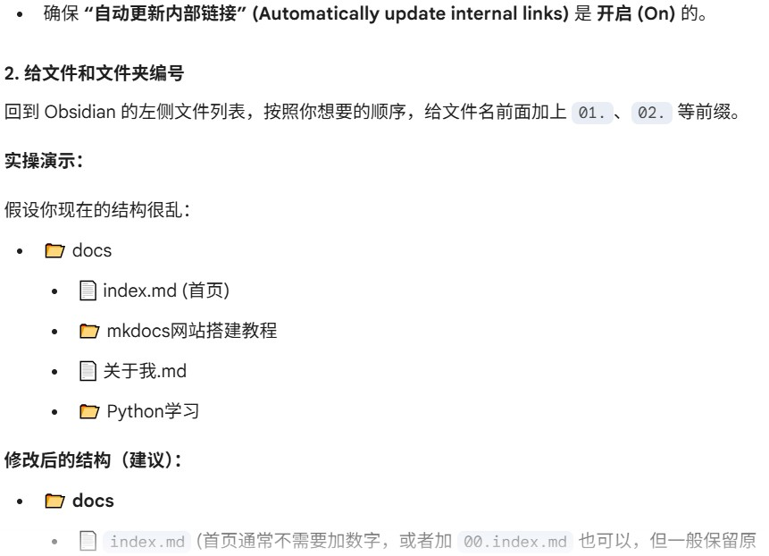

# 配置 MkDocs 以兼容 Obsidian 语法  
### 安装插件  
1. 打开Obsidian设置，点击第三方插件（Community plugins）,关闭安全模式  
2. 点击浏览（Browse）,搜索`Enveloppe`  
3. 点击后安装（install）并启用（enable）  
### 获取Github Token  
1. 登录Github  
2. 点击右上角头像 -> Settings -> Developer settings (最下面) -> Personal access tokens-> Tokens (classic)  
3. 点击Generate new tokens(classic)  
4. 登录  
5. Note随意填一个就好了  
6. Expiration (过期时间) 选 `No expiration` ，或者视你个人情况  
7. Scopes(权限)勾选：  
`repo` (全选，包含 repo:status, repo_deployment 等)  
`workflow` (如果要触发自动构建)  
8. 划到最下方，点击生成，复制`ghp_`开头的字符串，保存好，只会出现一次  
### 配置插件  
回到Obsidian，打开`Enveloppe`的设置页,配置方面我改了又改，感觉AI前后说法不一，可能是我对功能要求不一样吧  
#### GitHub config  
1. 依次输入GitHub username，Repository name，GitHub token（你刚复制的那串字符）  
2. Main branch选择main  
3. 点击下方test connection检查，右上角报绿就连接成功了  
#### File paths  
1. File tree in repository选择Obsidian Path  
2. Root folder输入docs  
#### Content  
1. 打开`[[Wikilinks]] to [MDlinks](links)`,选择strict  
2. 打开Markdown hard line break  
#### Attachment & embeds  
- Default attachment folder写docs/assets(如果没有就建一个assets文件夹)  
### 发布文章  
#### 前置准备  
这个我一开始没弄，搞了很久(Vscode里面改了之后可以用Vscode里面的源代码管理上传，也不强求在两个地方都写)  
1. 在项目文件夹下（可以同时看到docs和mkdocs.yml）建一个requirements.txt，在Github仓库中也要  
2. requirements.txt中输入  
```
mkdocs-material  
mkdocs-awesome-pages-plugin  
mkdocs-ezlinks-plugin  
```  
3. 终端运行  
```  
pip install -r requirements.txt  
```  
4. 在.yml中添加如下代码  
```  
plugins:  
  - search  
  - ezlinks  
  - awesome-pages  
```  
5. 在Github仓库中的code页面再建一个文件夹，名称为：`.github/workflows/publish.yml`,注意前面还有个点  
文件中输入：  
```c 
name: Publish to GitHub Pages  
  
on:  
  push:  
    branches:  
      - main  # 盯着你的 main 分支，一旦有变动就开始工作  
  
permissions:  
  contents: write  
  
jobs:  
  deploy:  
    runs-on: ubuntu-latest  
    steps:  
      - uses: actions/checkout@v4  
        
      - name: Configure Git Credentials  
        run: |  
          git config user.name github-actions[bot]  
          git config user.email 41898282+github-actions[bot]@users.noreply.github.com  
            
      - uses: actions/setup-python@v5  
        with:  
          python-version: 3.x  
            
      - name: Install dependencies  
        # 这里会读取你之前建的 requirements.txt 安装插件  
        # 如果你没建 requirements.txt，会自动安装基础包  
        run: |  
          if [ -f requirements.txt ]; then pip install -r requirements.txt; else pip install mkdocs-material mkdocs-awesome-pages-plugin; fi  
            
      - name: Deploy site  
        # 这一步把 Markdown 变成 HTML 并推送到 gh-pages 分支  
        run: mkdocs gh-deploy --force  
```  
#### 正常步骤  
1. 在文章开头输入以下代码  
```  
---  
share: true  
---  
```  
2. 停留在笔记页面，按Ctrl P(mac:Cmd P)打开命令面板  
3. 输入关键词Enveloppe，选择`Upload single current active note` (发布当前文件)  
然后等待即Github Actions变绿即可  
#### 设置快捷键  
- 还是要输入上面那个代码  
1. 打开Obsidian设置  
2. 在左侧找到快捷键（Hotkeys）  
3. 在搜索框中输入Enveloppe  
4. 选择`Upload single current active note`  
5. 输入喜欢的快捷键就好，我的是`Alt S`  
#### 一些问题  
- 用这个方法可能会把你仓库所有.md文档都传上去，所以把建议仓库中无用的.md文件删除   
- 如果遇到一些传输上的问题(Obsidian的)可以Ctrl shift i调出来之后把console中的报红扔给AI，让它帮忙解释和给出修改方案  
- 遇到一些其他问题也可以找AI，我结合Obsidian实操＋写教程＋与AI对线花了将近一天，AI真的能解决很多问题  
#### 索引设置  
